# Sauna — HackTheBox Write-up

**Active Directory | Windows Server | Difficulty: Easy**

🇧🇷 [Versão em português](README.md)

---

## Executive Summary

Sauna is a HackTheBox Windows machine simulating the Active Directory environment of a fictional bank (Egotistical Bank). The entry point wasn't a technical flaw but a process failure: full employee names were published on the company's own "About" page, making it possible to generate a wordlist of likely usernames and go straight for AS-REP Roasting with zero prior access to the domain.

From the foothold gained with that credential, a local enumeration tool (winPEAS) revealed AutoLogon credentials stored in plaintext in the registry, belonging to a service account that had been granted the `DS-Replication-Get-Changes` and `DS-Replication-Get-Changes-All` extended rights directly on the domain object — with no nested group chain involved at all. That direct grant of replication rights is, on its own, enough for a full DCSync.

## Machine Information

| Attribute | Value |
|---|---|
| Name | Sauna |
| Platform | HackTheBox |
| Operating System | Windows Server (Active Directory) |
| Domain | `EGOTISTICAL-BANK.LOCAL` |
| Difficulty | Easy |
| Category | Active Directory |
| Key techniques | OSINT, username generation, AS-REP Roasting, AutoLogon credentials, DCSync |

---

## 1. Reconnaissance

Initial port and service scan with Nmap's default scripts:

```bash
nmap -sC 10.129.36.152
```

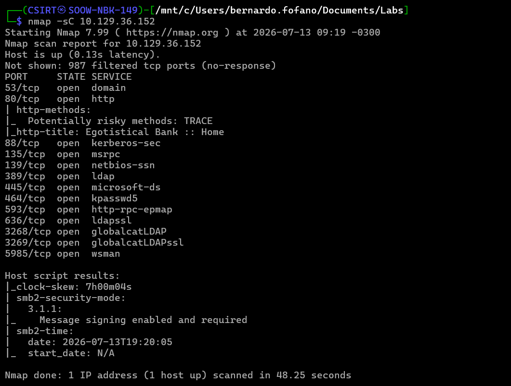

Beyond the classic Domain Controller fingerprint (Kerberos, LDAP, SMB), port 80 stood out for hosting a corporate site titled "Egotistical Bank" — a detail that pointed the next step of the investigation toward the site's own content rather than just its network services.

## 2. OSINT — Employee Names on the Website Itself

The site's "Meet the Team" page publicly exposed the full names of six employees of the fictional organization:

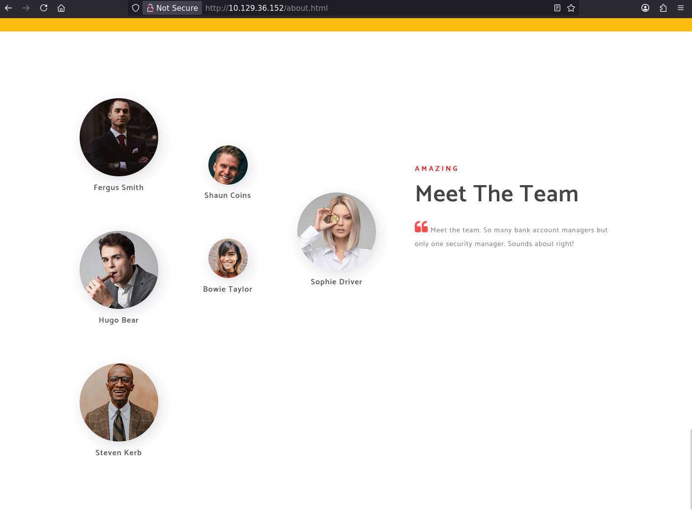

This is an extremely common information-leak pattern in real corporate environments: "About Us" or "Our Team" pages, designed to build customer trust, frequently hand over the first step of any username brute-force attack for free — the full names of people who hold accounts on the domain.

Since the exact username format used on the domain wasn't visible, the next step was generating every plausible variation (first name, last name, first initial + last name, etc.) with `username-anarchy`:

```bash
./username-anarchy --input-file names.txt > usernames.txt
```

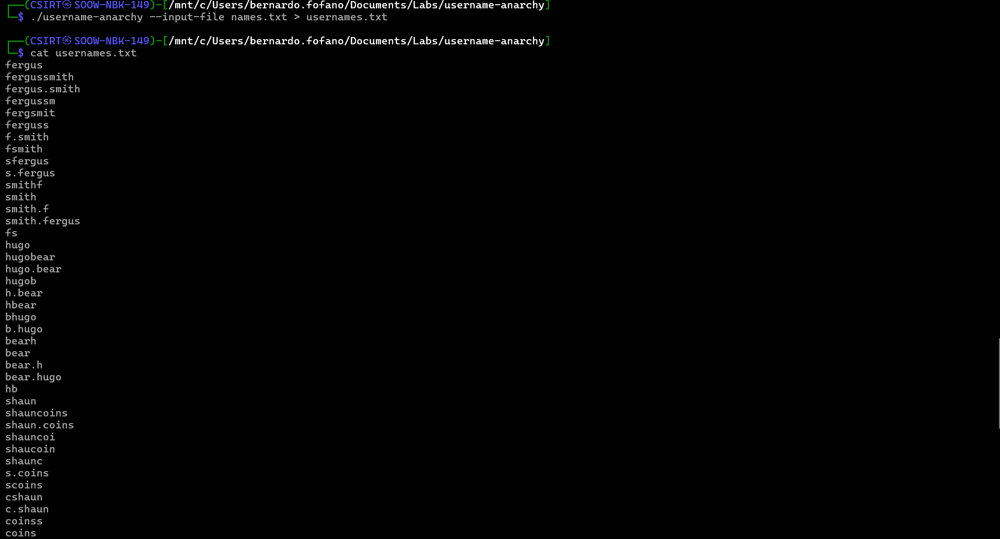

This step converts a list of public names into a wordlist of candidate credentials — an essential piece when there's no authenticated user enumeration available.

## 3. Initial Access — AS-REP Roasting

With the username wordlist generated, the next step was to directly test which of these likely names exist on the domain and have Kerberos pre-authentication disabled:

```bash
impacket-GetNPUsers EGOTISTICAL-BANK.LOCAL/ -no-pass -usersfile users.txt -dc-ip '10.129.36.152'
```

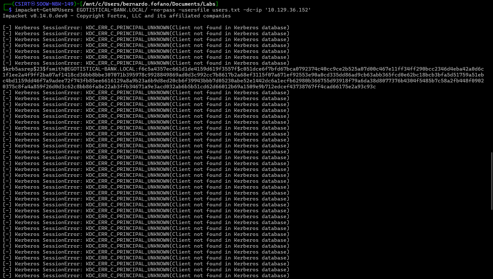

The vast majority of generated variations returned `KDC_ERR_C_PRINCIPAL_UNKNOWN` — meaning they don't correspond to real accounts — but `fsmith` (a variation of Fergus Smith) did exist and returned a `$krb5asrep$23$` hash. The volume of failed attempts isn't a problem with this technique: it's simply the cost of not having a pre-confirmed user list.

The hash was cracked offline with John the Ripper:

```bash
john --format=krb5asrep --wordlist=/usr/share/wordlists/rockyou.txt fsmithhash.txt
```

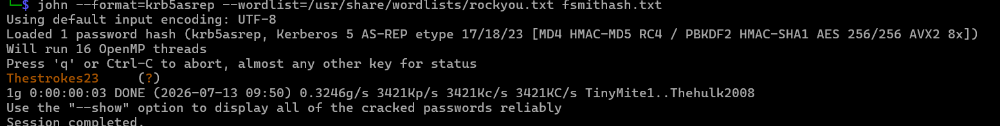

Password recovered: **`Thestrokes23`** — a pop-culture-based password (band name), common enough to be present in public wordlists like rockyou.txt.

## 4. User Flag

With valid credentials, WinRM access was straightforward:

```bash
evil-winrm -i 10.129.36.152 -u 'fsmith'
```

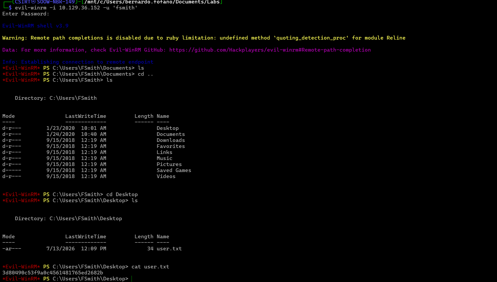

## 5. Mapping the Domain with BloodHound

```bash
bloodhound-python -u 'fsmith' -p 'Thestrokes23' -d EGOTISTICAL-BANK.LOCAL -ns 10.129.37.25 -c All
```

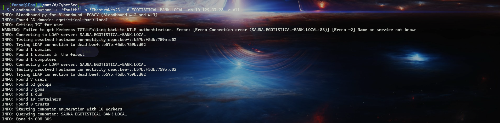

The collected domain is small (only 7 users), an early hint that the privilege chain would likely be short and direct. Data was collected for later analysis, in parallel with local enumeration on the box.

## 6. Local Enumeration — AutoLogon Credentials

With shell access in hand, the next step was running a local privesc enumeration tool. winPEAS was uploaded and executed, and one of its standard checks turned out to be decisive:

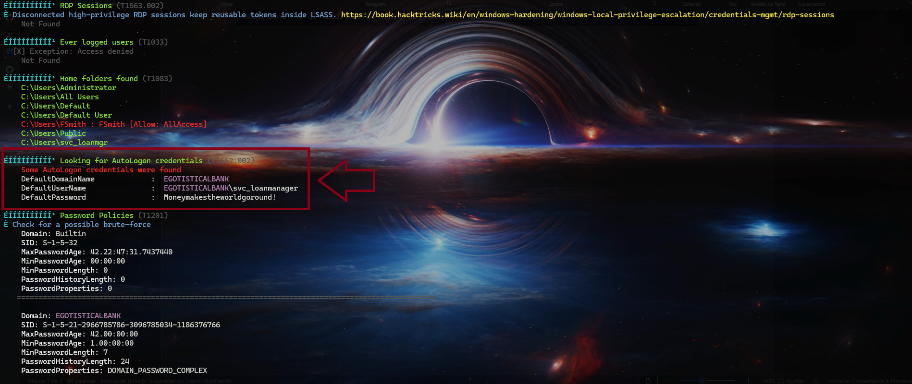

Windows allows configuring automatic login for an account by storing its username and password in plaintext under a registry key (`HKLM\SOFTWARE\Microsoft\Windows NT\CurrentVersion\Winlogon`) — a feature meant for operational convenience that, in practice, is one of the most direct forms of credential exposure in Windows environments. Here, the exposed account was `svc_loanmgr`, with the password `Moneymakestheworldgoround!`. Worth noting the account name itself ("loan manager") keeps the fictional bank's thematic consistency.

## 7. ACL Analysis — Direct Replication Rights

Going back to BloodHound with the new credential in mind, searching for the `svc_loanmgr` node revealed that the account has `GetChanges` and `GetChangesAll` granted **directly** on the domain object, with no group inheritance involved:

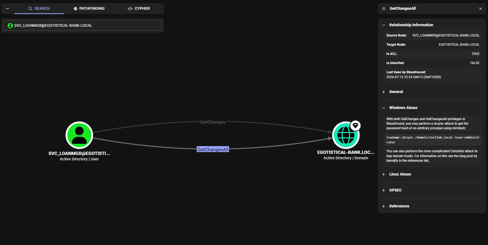

This is an important variation to understand in ACL-abuse attacks: not every path to DCSync goes through a multi-hop `GenericAll`/`WriteDacl` chain — sometimes replication rights are already granted directly to a service account, typically for administrative convenience (backup or sync accounts that legitimately need to read the whole directory). BloodHound itself points straight to exploitation via mimikatz or, in this attack's case, via Impacket's `secretsdump`.

## 8. DCSync and Domain Compromise

```bash
impacket-secretsdump EGOTISTICAL-BANK.LOCAL/svc_loanmgr:'Moneymakestheworldgoround!'@10.129.37.25
```

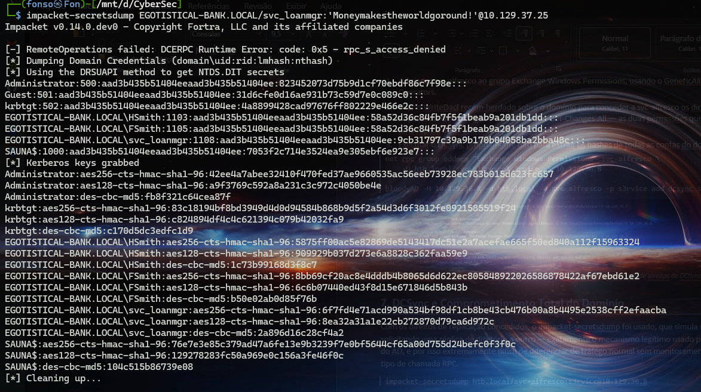

The small domain is confirmed here: just `Administrator`, `Guest`, `krbtgt`, `HSmith`, `FSmith`, `svc_loanmgr`, and the `SAUNA$` machine account. The Administrator's NTLM hash (`823452073d75b9d1cf70ebdf86c7f98e`) was successfully extracted.

## 9. Root Flag — Pass-the-Hash

```bash
evil-winrm -i 10.129.37.25 -u 'Administrator' -H '823452073d75b9d1cf70ebdf86c7f98e'
```

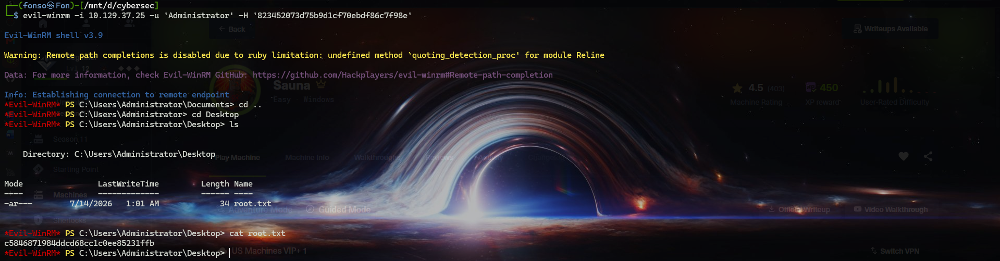

---

## 10. Attack Chain — Summary

1. Nmap identifies a Domain Controller (`EGOTISTICAL-BANK.LOCAL`) with a corporate site on port 80.
2. The site's "Meet the Team" page exposes employees' full names.
3. `username-anarchy` converts the names into a wordlist of likely usernames.
4. AS-REP Roasting against the wordlist reveals `fsmith` exists and has pre-authentication disabled.
5. The hash is cracked offline with John the Ripper (password: `Thestrokes23`).
6. WinRM access as `fsmith` — first flag captured.
7. winPEAS finds AutoLogon credentials stored in plaintext in the registry (`svc_loanmgr`).
8. BloodHound confirms `svc_loanmgr` holds `GetChanges` + `GetChangesAll` directly over the domain.
9. `secretsdump` runs the DCSync and extracts the Administrator's hash.
10. Pass-the-Hash completes total domain compromise.

## 11. Technical Takeaways

- Corporate pages ("About Us", "Our Team") are an underrated OSINT source: full names published by marketing become direct material for a username brute-force attack.
- Username generation (`username-anarchy` or equivalent) is a technique that compensates for the absence of authenticated enumeration — the cost of failed attempts is low relative to the payoff of discovering real accounts with zero prior access.
- Plaintext AutoLogon credentials in the registry are one of the most direct, and still common, forms of credential exposure in Windows environments — worth being one of the first checks in any post-shell local enumeration.
- Not every escalation to DCSync goes through a long ACL-abuse chain: replication rights granted directly to a service account are just as critical, and often easier to overlook precisely because they don't show up as an obviously visible chain.
- Small domains (few users and groups) don't mean a small attack surface — the whole domain is compromised with only 7 AD users.

## 12. Mitigation Recommendations

- Review all public website content before publishing — full employee names on marketing pages should be treated as security-sensitive information, not just an HR/communications matter.
- Never configure AutoLogon with plaintext credentials in the registry; if the feature is strictly required, use Credential Guard or LSA Protection to secure the stored values.
- Regularly audit which accounts hold `DS-Replication-Get-Changes` and `DS-Replication-Get-Changes-All` directly (outside the standard domain controllers group) — this kind of direct grant is easy to forget once configured.
- Monitor DRSUAPI calls originating from anything other than a legitimate Domain Controller.
- Apply the same password rotation and complexity rigor to service accounts as to privileged human accounts.

## Tools Used

| Tool | Purpose |
|---|---|
| Nmap | Port scanning and service detection |
| username-anarchy | Generating username variations from real names |
| Impacket (GetNPUsers, secretsdump) | AS-REP Roasting and credential extraction via DCSync |
| John the Ripper | Offline hash cracking (AS-REP) |
| Evil-WinRM | Interactive WinRM shell, including Pass-the-Hash |
| BloodHound / bloodhound-python | Mapping AD privilege relationships |
| winPEAS | Local Windows privesc enumeration |
